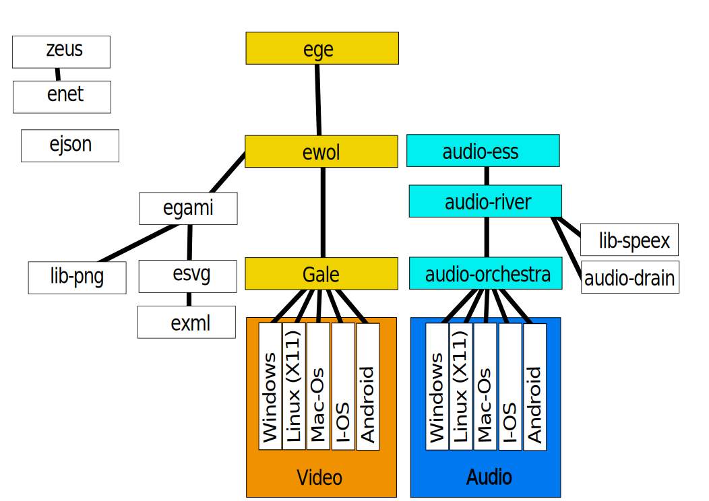

Ewol
====

`Ewol` (Edn Widget OpenGl Layer) is a FREE software.

Release (master)
----------------

Developement (dev)
------------------

Instructions
============

download Build system:
----------------------

	sudo pip install lutin
	sudo pip install pillow

need google repo:
-----------------

see: http://source.android.com/source/downloading.html#installing-repo

	mkdir ~/.bin
	PATH=~/.bin:$PATH
	curl https://storage.googleapis.com/git-repo-downloads/repo > ~/.bin/repo
	chmod a+x ~/.bin/repo

download the software:
----------------------

	mkdir WORKING_DIRECTORY
	cd WORKING_DIRECTORY
	repo init -u git://github.com/atria-soft/manifest.git
	repo sync -j8

Compile software and test:
--------------------------

	lutin ewol-*

Dependency packages
===================

Ubuntu Or Debian:

	sudo apt-get install g++ libgl1-mesa-dev zlib1g-dev libasound2-dev
	# Compile with Clang:
	sudo apt-get install clang
	# For andoid compilation (jdk 7 does not work...):
	sudo apt-get install javacc openjdk-6-jdk
	# Cross compile for windows:
	sudo add-apt-repository ppa:ubuntu-toolchain-r/test
	sudo apt-get update
	sudo apt-get install gcc-mingw-w64
	# On 64 bits processor for compatibility:
	sudo apt-get install ia32-libs
	sudo apt-get install g++-multilib libc6-dev-i386

Arch-linux:

	# Cross compile for windows:
	pacman -S mingw-w64-gcc
	
	# Cross compile for Android:
	in /etc/pacman.conf file uncomment:
		[multilib]
		Include = /etc/pacman.d/mirrorlist
	# update the system:
	Pacman -Syu
	# install lib C:
	pacman -S lib32-glibc lib32-zlib lib32-gcc-libs
	# install open-jdk 7.0
	pacman -S jdk7-openjdk
	# connect adb: (and you can do a "android/sdk/platform-tools/adb shell" to enable computer key on device)
	pacman -S android-udev

Simple framework overview
=========================

License (MPL v2.0)
==================

Copyright ewol Edouard DUPIN

Licensed under the Mozilla Public License, Version 2.0 (the "License");
you may not use this file except in compliance with the License.
You may obtain a copy of the License at

	https://www.mozilla.org/MPL/2.0

Unless required by applicable law or agreed to in writing, software
distributed under the License is distributed on an "AS IS" BASIS,
WITHOUT WARRANTIES OR CONDITIONS OF ANY KIND, either express or implied.
See the License for the specific language governing permissions and
limitations under the License.

